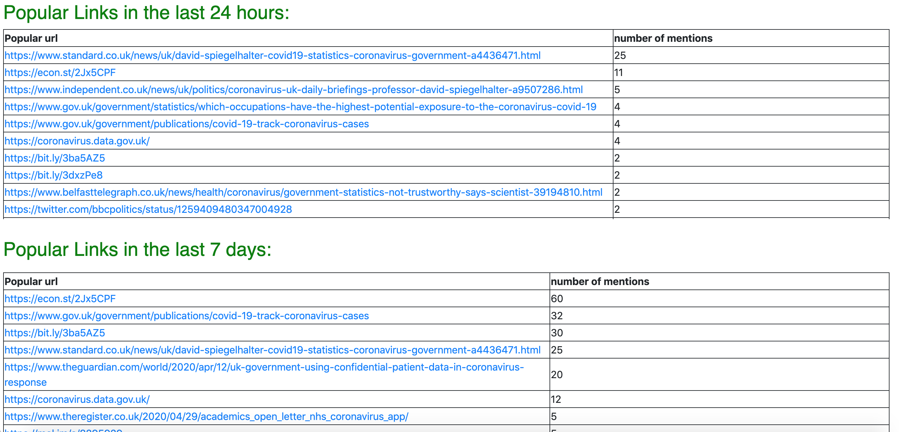

# Twitter dashboard

This twitter dashboard has been developed by the Office for Statistical Regulation (OSR) to help track important and prolific tweets
relating to the coronavirus. Although, the example search terms relate to coronavirus any search term can be used and therefore
it can act as a generic twitter dashboard that can be deployed to a cloud service of your choosing.

Below are screenshots of some of the functionality of the dashboard:

# Instructions for running the twitter dashboard

A description of the files is as follows:

## Tweet collecting and structuring
- *twitter_authentication.py*: This is the file where your twitter credentials should be input.
- *twitter_search.py*: This is where the tweets are taken from twitter based on a search term of your choosing. Search terms can be edited as per your requirements but should follow the AND and OR rules as per examples. This will need to be run twice currently for both the search terms changing Education to True to get the Education searches. This can be put into a loop if needed.
- *mine_tweets.py*: This mines the tweets into the correct format for the dashboard to read and is what is fed into the data_input.py file.

## Dashboard
- *data_input.py*: This loads all the data that is needed in the dashboard.
- *layouts.py*: This specifies some layouts that remain stable throughout the dashboard and separated from the main.py file for ease of reading.
- *main.py*: This is the main file that dictates the functionality of the dashboard. It pulls in information from the other two dashboard files to produce the dashboard.

The files need to be run in the following order:
1. twitter_search.py
2. mine_tweets.py
3. main.py

The code for collecting and mining the tweets has been modified as required from:
https://github.com/kshaffer/tweetmineR 