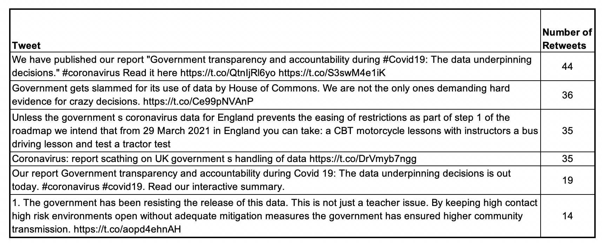
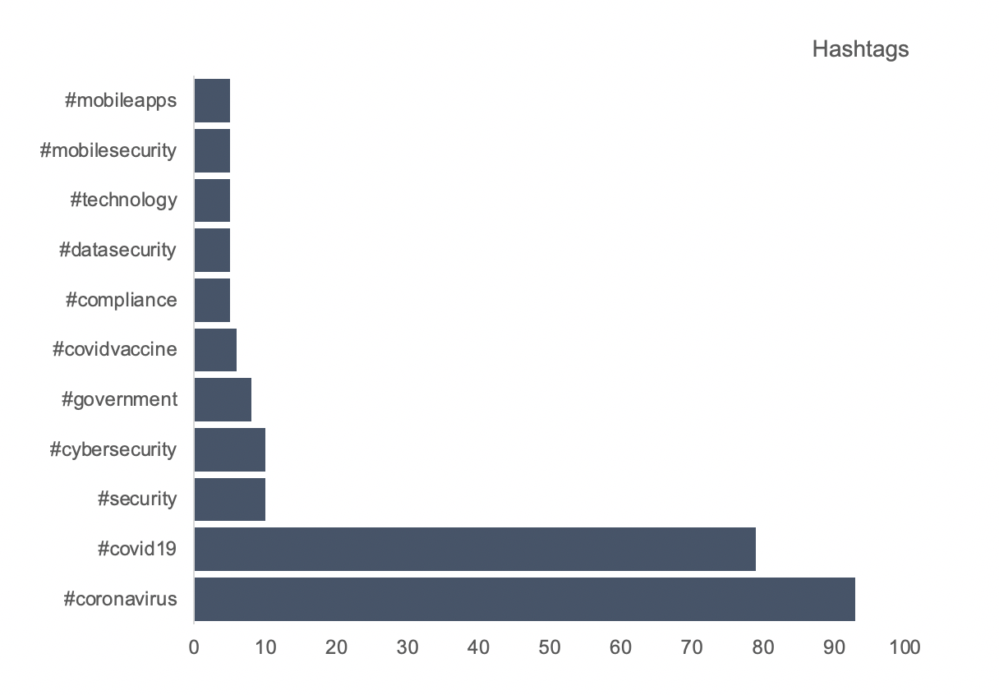
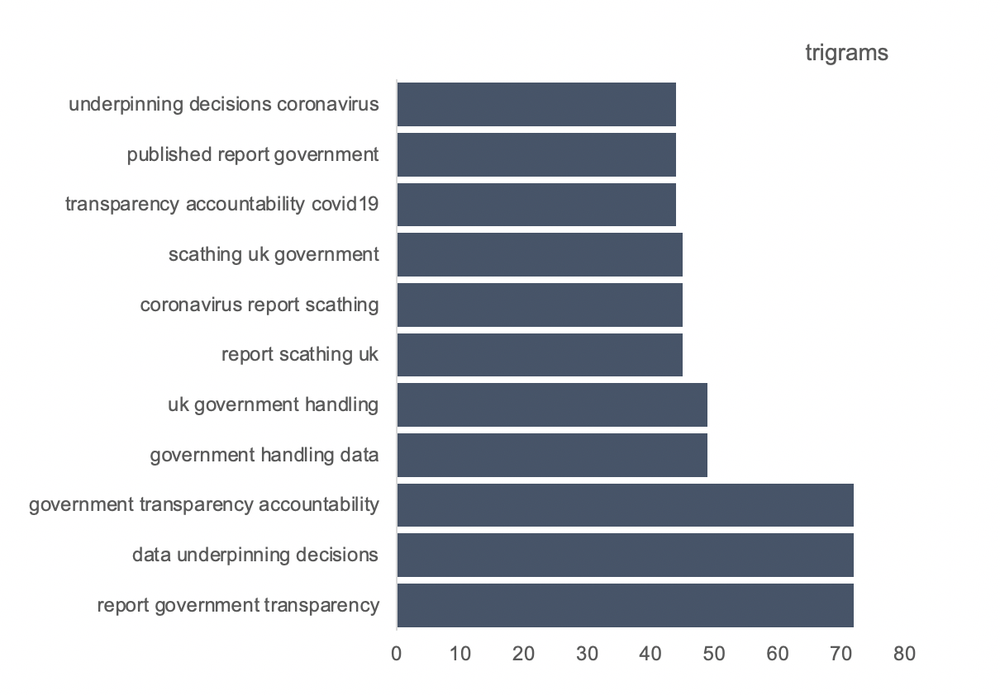
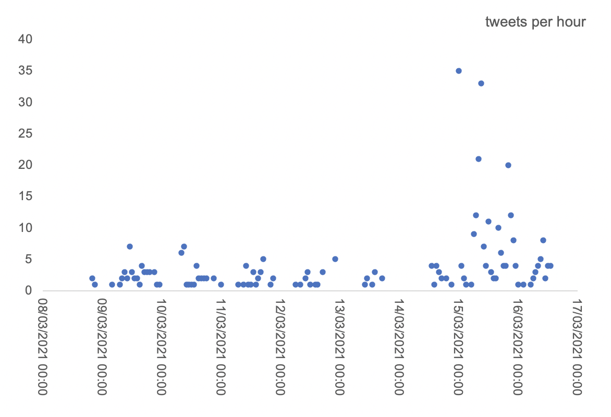

# Twitter dashboard

This Twitter analyser has been developed by the Office for Statistical Regulation (OSR) to help track important and prolific tweets relating to certain topics such as coronavirus (COVID-19), education, crime, and poverty.

### Getting

To clone locally use:

`git clone https://github.com/office-for-statistics-regulation/twitter-analyser`

### Setting

To install requirements `cd` to the cloned folder and use:

`pip install -r requirements.txt`

Please enter you [Twitter credentials](https://developer.twitter.com/en/docs/apps/overview) to `credentials_EMPTY.py` and rename to `credentials.py`. Do not push this information to a public place! `.gitignore` should prevent this from happening. 

Edit `config.py` with your desired search terms. Search terms can be edited as per your requirements but should follow the AND and OR rules as per examples.

### Using

First, you need to get the tweets by running:

`python get-tweets.py`

This will save the tweets to outputs/tweets.csv.

To mine these tweets for retweets, hashtags, trigrams and more run:

`python mine-tweets.py`

### Acknowledgements

The code for collecting and mining the tweets has been modified as required from:
https://github.com/kshaffer/tweetmineR 

### How we use the data

We collect tweets on various topics to help us understand what is being discussed on Twitter. We collect the tweet and some information about the person who sent the tweet. We delete the data after 30 days. Our main outputs are an internal dashboard. Below are screenshots of some of the functionality of the dashboard:

#### Most Retweeted

#### Hashtags

#### trigrams

#### Tweets per hour
