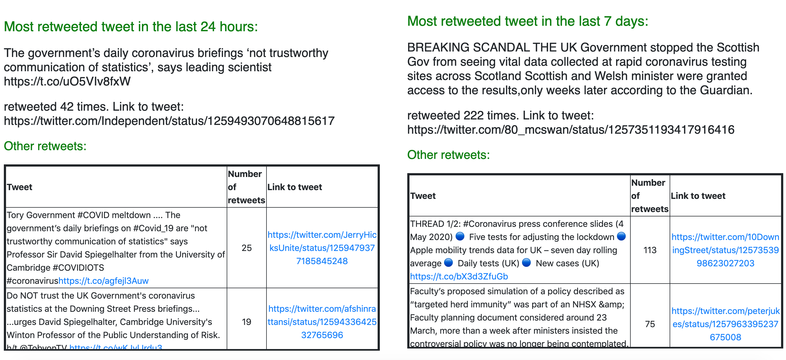
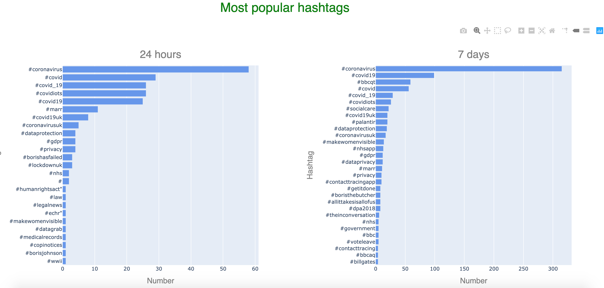
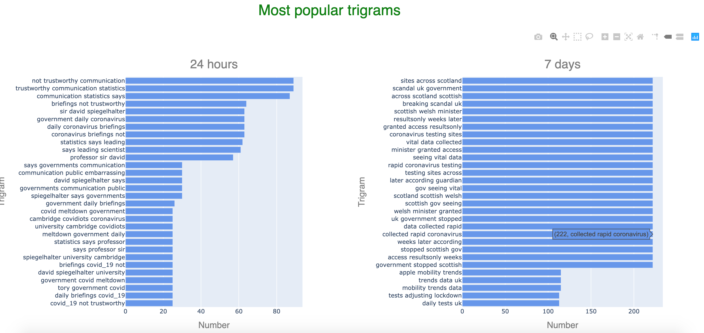
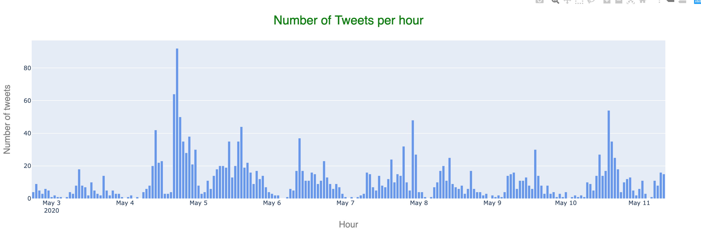

# Twitter dashboard

This Twitter dashboard has been developed by the Office for Statistical Regulation (OSR) to help track important and prolific tweets relating to certain topics such as coronavirus (COVID-19). Although, the example search terms relate to coronavirus any search term can be used.   

Below are screenshots of some of the functionality of the dashboard:

#### Most Retweeted

#### Hashtags

#### trigrams

#### Tweets per hour

# To Run

A description of the files in `local/functions` is as follows:

## Tweet collecting
- *twitter-scraper-tweets/credentials.py*: This is the file where your twitter credentials should be input.
- *twitter-scraper-tweets/config.py*: This is where you should specify the search terms. Search terms can be edited as per your requirements but should follow the AND and OR rules as per examples
- *- *twitter-scraper-tweets/main.py*: This is where the tweets are taken from Twitter and stored to `data/tweets.csv`

## Tweet mining
- *mine-tweets/credentials.py*: This is the file where your twitter credentials should be input.
- *mine-tweets/config.py*: This is where you should specify the location of the file created by the twitter-scraper-tweets function.
- *- *twitter-scraper-tweets/main.py*: This mines the tweets for retweets, hashtags, trigrams and more.

The code for collecting and mining the tweets has been modified as required from:
https://github.com/kshaffer/tweetmineR 